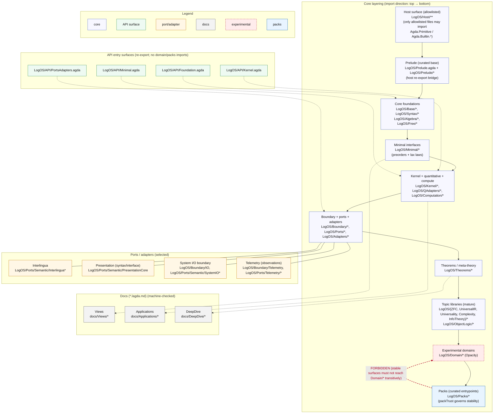

<!--
LogOS: a prototype Agda library for modular dynamic logic systems synthesized by AI
Copyright (C) 2026 AI.IMPACT GmbH
SPDX-License-Identifier: GPL-3.0-only
-->

# LogOS: a prototype Agda library for modular dynamic logic systems synthesized by AI

This repository contains **LogOS**, a prototype Agda library that treats logic systems as composable, swappable components in a network, with explicit ports/adapters for translation and interoperability, and with resources and effects threaded as first-class structure. One way to think about this is as a model for an "operating system" or a "hypervisor" for logic, with some applications to show this idea has some real teeth. 

It was obtained in a process that basically simulated the SDLC deep into production, with AI playing all the roles even if mostly coding, and a human operator providing steady feedback and steering. This is a highly iterative development workflow, supported by common software engineering best practice.  


## Dive right in

This repository is primarily designed for human-AI collaboration, with extensive documentation that is a weakly coupled part of the code itself. 

1. Download the repository. 
2. Install Agda and verify local compilation using "make check-all".
3. Ask your favorite code assistant (Codex, Claude Code, OpenCode, Cursor, etc.) to familiarise itself with the content of the repository folders as a 'priming' prompt. 
4. Start exploring, learning and building. 

If you just want to explore the docs, skip step 2 :). 

For instance, ask to explain what is interesting. 

Human-readable literate documentation is in the /docs folder. For logicians, the [Meredith sentences](docs/Views/MeredithSentences.lagda.md) are likely most interesting as a condensed view. For PL people, the [Curry-Howard-Lambek view](docs/Views/CurryHowardLambek.lagda.md), for physicists the [info-theory parts](docs/Applications/InfoTheory.lagda.md) and for software engineers the [architecture overview](docs/Architecture_Diagram.md) are likely most interesting entrypoints.

The guardrails detailed below have been designed to help a human-AI collaboration to incrementally but systematically increase information coherence and consistency inside the repository. Note that the operator of the agents is included in this list - this repository is more a cybernetic skeleton for long-term use than an AGI-golem. 

To set expectations: this repository is the result of several months worth of COTS inference compute, mostly spent in dialog and mostly spent on understanding, correcting and improving previous results. Do not expect instant magic, even if the results occasionally feel like it.


## Design Philosophy

We design a logic theory as an enterprise scale software artifact.

### Architecture diagram



See [`docs/Architecture_Diagram.md`](docs/Architecture_Diagram.md) for the canonical diagram and enforced invariants.

The logic in this repository aims to be bare‑minimal: strong enough to compose, translate, and stabilise real reasoning systems, but weak enough to stay general and portable. We therefore build on preorders as the default semantic substrate, and we use lax structure (lax morphisms/adjunctions) as the default notion of “law”, so irreversible or approximate structure doesn’t get collapsed by extensionality. As a design pattern we consistently choose refinement (⊑) over equality as the primitive comparison; bi‑refinement / mutual refinement (≈) is derived notation, and propositional equality (≡) is kept separate and only used when we explicitly opt into stronger assumptions.

Quantitative parameters are first‑class, not an encoding layer: a QAdapter supplies a prequantale‑like budget/grade algebra (finite joins + monoidal multiplication) together with a time monoid, and the rest of the library treats this as native structure for resources, effects, and “how much observation/interaction happened”. This is also where “controlled feedback” sits: the kernel exposes a compute‑then‑stabilise pattern as an explicit closure step (Flow) with a distinguished lax fixed‑point witness (Th*), and on the code side as the one‑step evolution (Guard ∘ Body) together with the stabilising modality (Box (Body _)). In other words, recursion/feedback is treated as budgeted stabilisation by default, not as a free global least fixed point.

Infinities and generalisation follow the same discipline: you can reason about unbounded behaviour, but any upgrade to μ/leastness, infinite runs, or completeness‑style principles happens only under explicit ωCPO/continuity/finite‑first hypotheses. In the repository this “finite evidence warrants a general conclusion” policy is named (budgeted) adequacy: an explicit order‑reflection assumption for a chosen budget‑restricted observation regime. Finally, category theory is treated as an object theory (OO‑style as an analogy): preorders are read as thin categories, the ports/adapters spine is packaged as a locally‑preordered 2‑categorical calculus, and “ports & adapters” becomes a precise categorical notion of presentation and translation—so interoperability is structural, and translations are forced/unique up to satisfaction equivalence (↔) when boundary satisfaction agrees.

If you are looking for the “fractal” story (the same pattern repeated: **presentation choice → canonical translation → theorem/tool transport**, and **one-step computation → budgeted stabilisation → communicable truth**), start here:

- Controlled feedback / communication boundary: `docs/DeepDive/Communication.lagda.md`
- Futamura × diagonal × bootstrapping as presentation transport: `docs/DeepDive/FutamuraDiagonal_Showcase.lagda.md` (and the shorter `docs/Applications/FutamuraDiagonal.lagda.md`)
- Maximal Flow-stable (“communicable”) truth: `LogOS/Theorems/Meta/CommunicableTruth.agda` (+ graded/budgeted variant: `LogOS/Theorems/Meta/BudgetedCommunicableTruth.agda`)
- Diagonal / Lawvere fixed point as explicit assumption packs: `LogOS/Theorems/Meta/Assumptions/Diagonal.agda`
- Pseudo-functoriality of canonical translation (id/comp laws): `LogOS/Theorems/Meta/SemanticsTransport.agda`

## High level motivation and overview of results

Science provides formal tooling to distill information in formal models. As AI is among the most powerful technologies for information processing invented, it has the potential to change parts of scientific modelling workflows, for instance by leveraging the cross-domain insights encoded in its training data. We show it is possible to operationalise core formal model building by using COTS AI coding agents in a carefully designed environment grounded in Agda, a programming language for mathematical proofs. This environment and its meta-rules allow careful extension of logic coherence to large-scale systems.

The main advance is an architecture for partially-reflective logic systems, grounded in simple mathematical primitives (preorders/refinement (read as thin categories under proof-irrelevance), lax operators and prequantale-valued parameters), with a tiered S/H/G/R kernel interface and explicit claim discipline (see `docs/LogOS_Core_Spec.lagda.md` and `docs/Kernel/ClaimRegister.lagda.md`). Novel is a truth notion as "stability under resource-constrained communication" in an [observer semantics](docs/Views/ObserverSemantics.lagda.md). The environment allows current generation AI agents to build, evaluate and refactor axiomatic dependencies of theories and theorems under human guidance.

The kernel symbols and their relations support multiple, mutually consistent interpretations aligned with different logic traditions and abstractions: `docs/Views/MultiInstitution.lagda.md`, `docs/Views/HomotopyTypeTheory.lagda.md`, `docs/Views/CategoricalLogic.lagda.md`, `docs/Views/Topos.lagda.md`, `docs/Views/ObserverSemantics.lagda.md`, `docs/Views/CurryHowardLambek.lagda.md`, `docs/Views/MeredithSentences.lagda.md`.

<!-- CLAIM-STAMP: LITERAL | anchor=LogOS/Packs/ZFC/Core.agda#WFGraph -->
<!-- CLAIM-STAMP: LITERAL | anchor=LogOS/Packs/UniversalIR/Core.agda#surface -->
To showcase proof of value, we generalise hexagonal architecture patterns to foundational logic to separate an abstraction we term "OS kernel" from common axioms that form the basis of "application packs" with more specialised axiom sets. We showcase a mechanised [ZF(C) axiom ledger](docs/Applications/ZFC.lagda.md) with a well-founded membership-graph semantics route and an explicit Choice witness (Choice is not derived), as well as a universal-IR execution core with cross-paradigm agreement theorems for selected fragments, aligned with the “mechanisable ⇒ simulable” direction of Church–Turing-style principles: LogOS makes that direction explicit as a checked, assumption-scoped statement, and keeps any “physics ⇒ mechanisable” claim outside the core. See [Universality](docs/Applications/Universality.lagda.md) for the precise boundaries. Interestingly, these applications involve only slightly differing axiom packs. An agents pack provides an indication of immediate relevance to real-world design problems.

<!-- CLAIM-STAMP: REPRESENTATIONAL | anchor=LogOS/Packs/Complexity/Experimental/PvsNP/Public.agda#surface -->
We briefly investigate similar ["reverse mathematics"](docs/Applications/Complexity.lagda.md) applications to open problems, highlighting non-standard axiom sets that form conditional proofs. For complexity separation this encodes a conditional separation template inspired by Aaronson's discussion, making every assumption explicit and machine-checked. Our results connect to known models across different domains, times and communities, showing that several familiar models can be hosted behind the same kernel/adapter discipline.

The key meta-insight in this library is that epistemic limitations and cost ("the boundaries") are much more of an opportunity than typically appreciated in foundational science. The rather urgent question of interpretation of this insight is left out of scope here, as that seems to be a question of (uncommunicable) belief more than one of science.


## Meta-Conjecture

<!-- CLAIM-STAMP: ANALOGY | anchor=docs/Applications/InfoTheory.lagda.md#meta-conjecture -->
A working conjecture suggested by this repository is that its kernel plus Shannon/observer interfaces can be viewed as a small [axiomatic core for information-like reasoning](docs/Applications/InfoTheory.lagda.md) across several domains. If that viewpoint holds up under external review, it may help explain why similar algebraic patterns recur across IT-adjacent formalisms. This conjecture is not required to use the library as a practical assumption-scoped modelling environment when leveraging coding agents.

## Guardrails for AI-assisted development

The epistemic status of the repository is somewhat unusual due to extensive use of coding agents. On the one hand, verifying all of these results using traditional methods requires a full research university worth of experts - this verification has not taken place yet (#understatement). On the other hand, it is verified to a standard that is very rare in academia (or in industry) through machine-checked code as well as through a very broad variety of re-derivations and formalisations of known results. Not many articles mechanise ZFC Set Theory just to show a core technology is sane. In this section we briefly show which guardrails have been deployed to guarantee epistemic safety, and indicate some limitations.

### Agda
Agda is a dependently typed programming language with tooling to act as a proof assistant.
Agda comes with some options for levels of type checking for its compiler. This repo uses:

- `-W all -W error` — all warnings turned on; warnings are treated as errors.
- Exact-split remains enabled in strict mode; the `CoverageNoExactSplit` warning class is silenced (`-W noCoverageNoExactSplit`) because Agda builtin modules can trigger it on pinned CI toolchains.
- `--safe` — disallow certain unsafe pragmas/placeholders (still relative to the Agda checker).
- `--no-libraries -i .` — build a external-minimal surface.

These flags show intent - they are however not a guarantee.

### Continuous Integration
Continuous integration is a development praxis where each new feature is immediately checked in a testing harness. Here the coding agents run CI after each bigger refactoring project. Currently, CI runs `make check-all` (cold full gate: `clean` + policy checks + full typecheck of all `*.agda` and
`*.lagda.md`, including the transformer scaling pipeline modules) plus a library-file smoke test (`make agda-lib-check`). See `.github/workflows/ci.yml`.
For development loops, use `make check-quick` (policy + full `*.agda` check + library smoke test; docs are skipped for speed).
Use `make check-quick-no-transformer` when iterating outside transformer work.
`make check-all-clean` remains a compatibility alias for `make check-all`.

Transformer pipeline runtime note:
- `scripts/check_all_agda.sh` splits checks into a main pass and a dedicated transformer-pipeline pass.
- The script prints:
  - `check-all-agda: main pass completed in ...s`
  - `check-all-agda: pipeline module ... completed in ...s`
  - `check-all-agda: pipeline pass completed in ...s`
- `check-quick-no-transformer` sets `PIPELINE_SKIP=1`, so the dedicated pipeline pass is skipped intentionally.
- Measured profile (2026-02-09):
  - warm `make check-quick`: main pass `~18s`, pipeline pass `~35-49s`
  - cold `make check-all`: main pass `314s`, pipeline pass `2765s`
  - dominant cold hotspots: `TransformerKolmogorovScaling` (`867s`), `TransformerScalingPipeline.Calibration` (`336s`), `TransformerScalingPipeline.ExperimentalCompute` (`277s`), `TransformerScalingPipeline.Examples` (`266s`), `TransformerScalingPipeline` (`250s`), `TransformerScalingPipeline.Core` (`206s`), `EmitBridge` (`196s`)
- If you only see a small main-pass number (for example `18s`), this is expected on warm caches; the pipeline pass is a separate line and still part of `check-quick`.

Timing command:
- `time make check-quick > /tmp/check_quick.log 2>&1`
- `time make check-quick-no-transformer > /tmp/check_quick_no_transformer.log 2>&1`
- `time make check-all > /tmp/check_all.log 2>&1`
- `rg "check-all-agda: (main pass completed|pipeline module|pipeline pass completed|pipeline pass skipped)" /tmp/check_quick_no_transformer.log`

### Software Quality
Architecture and code quality are continuous concerns. We take the view that we rather solve explicit coding issues based on domain concerns than impose a rigid architecture upfront.  In this repository code quality concerns correlate with particular concerns in mathematics of information science. To make this work we refactor often, including breaking refactors. A key goal is to keep the codebase as small as possible. Coding agents tend to prefer new development over reworking older parts - the user has to steer (hard) against this, otherwise spaghetti code is the result. 

Code architecture reviews are used to identify larger issues. A core pattern we use are [ports and adapters](docs/DeepDive/Architecture_PortsAdapters.lagda.md) from [hexagonal architecture](https://alistair.cockburn.us/hexagonal-architecture). The original motivation for this was isolating logic inside code components, which is the role we use it for here. We use it especially to separate "kernels" from "applications" for foundational logic. See [`docs/Architecture_Diagram.md`](docs/Architecture_Diagram.md) for a one-page visual overview of the architecture.

A key insight to operationalise this is to let the agent focus on inconsistencies, instead of asking it to make things more consistent. The latter invites hallucinations. The first almost always finds something actionable. A clear sign of convergence is when the coding agent, after several rounds of improvements starts to focus only on the documentation. An interesting prompt is to ask to identify “bad code smells” or “bad architecture smells”. This works as it points the chatbot to the “refactoring to patterns” framework. Asking for focussed code improvements is also valuable, as long as the agent gets some idea of where to push towards. The operator remains responsible for vision and supervision. 

### Multipassing
An underrated technique to get a coding agent to perform larger scale operations to the end is to simply ask for the same thing several times. This resembles multi-passing for code optimisation in compilers. A variant of this involves resetting the coding agents memory, basically simulating getting a fresh “peer reviewer” to get a look. A more involved variant of multi-passing requires humans asking questions any developer would be asked by product owners, e.g. questions of performance, security and reliance. Regular architecture reviews using SOTA deep research is also part of a wider safety net.

### Documentation
We employ documentation-as-code. The repository uses literate Agda (`*.lagda.md`) to mix text and machine-checked code. We use this to institute integration checking, as well as semantic scaffolding for the coding agents to have a "big picture" to orient along. A fair portion each cycle is spent removing inconsistencies from the documentation. 

### Literature
We view existing literature as part of the wider safety net for especially scientific models. Especially important “textbook” results are useful as they are reflected deeply into the training corpus of chatbots. This is noticeable as chatbots tend to revert to the original, older literature somewhat over newer results. To surface newer results one typically has to push harder and more specifically. We use literature results partly as a class of “integration tests” that fail when a breaking change occurs.  

There are many, many links to the literature due to fundamental semantic polymorphy. Some concepts relevant for this repository during its development were especially the [Curry-Howard-Lambek correspondence](docs/Views/CurryHowardLambek.lagda.md), the idea of "universal logic", Futamura's projections, Lawvere's fixed point theorem, holographic renormalisation and renormalisation theory, especially the Connes-Kreimer variant, Analytic S-matrix theory as well as basic notions of quantum mechanics. We have used these partly as goals, partly as analogs and throughout as scaffolding to find the next refinement. This list is by no means the only road you could take.

### The Operator
The operator of a coding agent has in this framework the role as the ultimate arbiter of architecture and truth. In practice this is mostly steering, with exceptions when a hard decision has to be made. These hard decisions get less the clearer the framework becomes inside the repository. Also, the coding agent can help clarify decision parameters and, to an extent, impact on the codebase. 

### Limitations to guardrailing

No guardrailing on a software system of this level of complexity is perfect. The current speed of safe development bottleneck seems to be the ability of an operator to learn about this system and guide through the resulting refinement options. 

The biggest risk remaining is that of semantic divergence: the code not doing what the documentation says that it is doing. By compartmentalising concerns through architecture this is mitigated - agents can check module-by-module. The loose coupling through ports and adapters also greatly reduces blast radii. AI-driven reviews have diminishing returns in their current state - the meaning of the system is largely approaching stability. Ultimately this remaining risk can only be fixed fully by external semantic peer-review.

A final risk is the Agda compiler itself - although this is not a green-fields development, soundness and consistency proofs in Agda code are only relative to the Agda compiler. Exploratory implementations in Rocq and in Redex (not part of this release) indicate the core math is consistent.

## Repository overview

The main documentation lives in `/docs`. Uploading `docs/LogOS_Core_Spec.lagda.md` or almost any of the other docs to a reasoning chatbot instantiates a conversational interface to start exploring the framework. This uses the chatbot as an effective stochastic interpreter. Ensure that memory features of the chatbot are disabled to avoid polluting cross-conversation chatbot memory. For bonus points: ask the chatbot to use the library to explain why this tip works based on a density of information argument. Beware of sycophancy induced by logic: not all suggestions as "next steps" are achievable in finite time, or require technology you have to formalise first. Also, often the suggestions of the chatbot adhere too closely to the literature, where a more efficient implementation in LogOS is possible. 

## Usage tips

Interpretation (analogy): you can view the library as an ["OS-style" abstraction](docs/Architecture_Diagram.md)
for composing logic-system components (kernels + ports + adapters). The literal
content is the Agda API and the curated packs.

Always ensure good coding architecture (clean code, clean architecture for starters) in any new model for optimal results. Refactor almost constantly for presentation, and double and triple check results, ideally resetting chatbot memory to mitigate confirmation bias. Ask for better integration of [kernel functions](docs/LogOS_Overview.lagda.md) - their use is not always optimal downstream, especially if the result you are after is not in the literature. Best results are obtained usually with SOTA reasoning models, but these come with a hefty cost of time. Note that developments that align with classical literature are noticeably easier as the coding agents roughly know what to build. Directions perpendicular to the knowledge coded into the chatbots require more human supervision.

A word of warning: LLMs become generally more coherent, but occasionally also more unstable for context involving concentrated logic due to the presence of contextualised homonymy and polysemy in their training data. The coherence likely originates in the extreme coherence of the logic literature across papers. Aligning prompts with that literature raises bias, but reduces variance. Provocative questions and drives for particular novel interpretations or results raise variance, but reduce bias having less support in the logic literature. Semantic polymorphism makes all of this harder to navigate - chatbots need to spend tokens to distinguish between "literally" and "figuratively", or, related, syntax and semantics. This is where ports&adapter architecture helps. 


## Some features

Requirements: Agda `2.8.0`.

```sh
# Type-check the minimal API (no global libraries needed)
agda --no-libraries -i . LogOS/API/Minimal.agda

# Run policy checks + vacuity/correctness checks + tests + docs
make ci
```

Optional publication sanity (heavier):

```sh
make check-all
```

Same checks, cache-reusing dev loop:

```sh
make check-quick
```

Minimal “hello import”:

```agda
module Hello where
open import LogOS.API.Minimal
```

## Docs

Start here (literate Agda):
- Architecture + entrypoints: `docs/LogOS_Overview.lagda.md`
- Kernel claim register (what “truth” words mean): `docs/Kernel/ClaimRegister.lagda.md`
- Research-grade spec: `docs/LogOS_Core_Spec.lagda.md`

Kernel views (semantic polymorphism):
- Views index: `docs/Views/All.lagda.md`
- Terminology (literature ↔ LogOS): `docs/Terminology.lagda.md`
- Multi-institution: `docs/Views/MultiInstitution.lagda.md`
- 3-level HoTT-style: `docs/Views/HomotopyTypeTheory.lagda.md`
- Categorical logic (2-category view): `docs/Views/CategoricalLogic.lagda.md`
- Topos-shaped reading (nuclei/sheaves): `docs/Views/Topos.lagda.md`
- Observer semantics: `docs/Views/ObserverSemantics.lagda.md`
- Curry-Howard-Lambek capstone: `docs/Views/CurryHowardLambek.lagda.md`
- Meredith sentences (ultra-compact core math): `docs/Views/MeredithSentences.lagda.md`

Applications:
- ZFC story: `docs/Applications/ZFC.lagda.md`, `docs/DeepDive/ZFC_Demo.lagda.md`
- Complexity story: `docs/DeepDive/Complexity.lagda.md`, `docs/Applications/Complexity.lagda.md`
- Universality story: `docs/Applications/Universality.lagda.md`, `docs/Library.lagda.md`
- Opacity story (observability ledgers + no‑total‑oracle theorems): `docs/Applications/Opacity.lagda.md`
- InfoTheory story (Shannon + DPI/Capacity/ThermoRG): `docs/Applications/InfoTheory.lagda.md`
- Agents story: `docs/Applications/Agents.lagda.md`
- Conditional applications: see the relevant application notes under `docs/`

HTML docs (Agda HTML backend):
- Build locally: `make html` → `_build/html/index.html`

## Entry Points

Recommended import surfaces:
- Minimal API: `LogOS/API/Minimal.agda`
- Kernel API (canonical interface): `LogOS/API/Kernel.agda`
- Bridge connectors (tier/repr/flow/limit): `LogOS/API/Bridges.agda`
- Architecture map (ports/adapters spine): `LogOS/API/Architecture.agda` (see also [`docs/DeepDive/Architecture_PortsAdapters.lagda.md`](docs/DeepDive/Architecture_PortsAdapters.lagda.md))
- One-page architecture diagram: [`docs/Architecture_Diagram.md`](docs/Architecture_Diagram.md)
- QAdapter instances: `LogOS/QAdapters/All.agda`
- Core theorem surface: `LogOS/Theorems/Core.agda`
- Transpiler pass calculus: `LogOS/Theorems/Meta/Transpiler.agda` (operational layer: `LogOS/Theorems/Meta/Transpiler/Operational.agda`)
- Bootstrapping: `LogOS/Theorems/Meta/Bootstrapping.agda`
- ZFC (stable): `LogOS/Packs/ZFC/All.agda` (WFGraph quartets: `LogOS/Packs/ZFC/WFGraph.agda`)
- UniversalIR (stable): `LogOS/Packs/UniversalIR/Core.agda`
- Universality bundle (stable): `LogOS/Packs/Universality/All.agda`
- Universality core (stable): `LogOS/Packs/Universality/Core.agda`
- Complexity (experimental): `LogOS/Packs/Complexity/Experimental/Core.agda`
- Opacity (experimental): `LogOS/Packs/Opacity/Experimental/Core.agda` (kernel-derived observability + barrier theorems)
- InfoTheory (stable): `LogOS/Packs/InfoTheory/Core.agda`
- Agents (stable): `LogOS/Packs/Agents/All.agda` (meta-language: `LogOS/Packs/Agents/MetaLanguage.agda`)
- Agents (experimental): `LogOS/Packs/Agents/Experimental/All.agda`

## Trust Boundary

- The safe core is intended to be imported via `LogOS/API/Minimal.agda` and contains no global postulates.
- Models that need ω‑chain suprema supply them explicitly via `LogOS/Axioms/OmegaSup/Interface.agda` (`ChainSup`) and `omegaCPO-from-chainSup`.
- Pack surfaces export `packTrust : PackTrust` (see `LogOS/Packs/Trust.agda`) to flag `stable`/`experimental`/`scaffold`/`deprecated`.
- CI enforces pack-trust metadata via `make pack-trust-check` (included in `make ci-policy` / `make ci`).
- Experimental surfaces are under evaluation and should be considered less stable than the rest of the repository.
- This repo does not claim classical proofs of famous conjectures (e.g. GRH/RH, P vs NP). Those strands are modeled as conditional ledgers and proof templates that isolate minimal assumptions ([reverse mathematics](docs/Applications/Complexity.lagda.md)), and are interesting even without new classical proofs.
- This repository is AI-generated; use the Agda checker and the stated trust levels as your primary guardrails.

Host surface (portability):
- Direct imports from `Agda.Primitive` / `Agda.Builtin.*` are intentionally restricted to a small allowlist:
  - `LogOS/Host/Level.agda`
  - `LogOS/Host/Nat.agda`
  - `LogOS/Host/Bool.agda`
  - `LogOS/Host/List.agda`
  - `LogOS/Host/Maybe.agda`
  - `LogOS/Host/String.agda`
  - `LogOS/Host/Relation/Binary/PropositionalEquality.agda`
- CI enforces this via `make host-surface-check` (included in `make ci`).

## Build Targets

- `make ci` — policy checks + tests + docs
- `make vacuity-check` — vacuity guard surfaces (non‑vacuous claims)
- `make correctness-check` — correctness surfaces (soundness/adequacy)
- `make packs` — type-check curated packs
- `make html` — build HTML docs into `_build/html/`
- `make check-quick` — warm dev loop (`ci-policy` + all `*.agda` + `agda-lib` smoke; skips docs)
- `make check-quick-no-transformer` — same as `check-quick`, but skips transformer pipeline pass (`PIPELINE_SKIP=1`)
- `make check-all` — cold full gate (`clean` + `ci-policy` + all `*.agda` + all `*.lagda.md` + `agda-lib` smoke)

## License and Citation

- License: GPL-3.0-only (`LICENSE`)
- Commercial licenses: contact **logos at ai-impact.com**
- Citation metadata: `CITATION.cff`

<details>
<summary>Agda library setup (optional)</summary>

This library ships `LogOS.agda-lib`.

- Register in your global libraries file (e.g. `~/.agda/libraries`), then:
  - `agda -l LogOS LogOS/API/Minimal.agda`

Local setup note (library trouble):
- Quick fix: use `agda --no-libraries -i . LogOS/API/Minimal.agda` (no global config needed).
- If you prefer `-l LogOS` without touching `~/.agda/libraries`, create a repo-local
  `local.agda-libraries` file with the full path to `LogOS.agda-lib`, then run:
  `agda --library-file=local.agda-libraries -l LogOS LogOS/API/Minimal.agda`.

Using alongside agda-stdlib:
- This codebase ships a minimal host surface so it can build without stdlib.
- LogOS uses namespaced host wrappers under `LogOS/Host/*` (re-exported via `LogOS.Prelude` / `LogOS.Prelude.*`).
- If you want to use agda-stdlib in the same project, prefer importing LogOS via the API modules and avoid mixing stdlib `Data.*` modules into the LogOS core.

</details>

<details>
<summary>Tensor / Endomap DSL (boundary-level “process calculus”)</summary>

This repo exposes a conservative DSL over monotone boundary endomaps:

- `LogOS/Kernel/TensorDSL.agda` (also re-exported by `LogOS/API/Minimal.agda`)
- Canonical fixed-point surface: `Th⋆K`, `FlowTh⋆K`, `Th⋆≤FlowTh⋆`, `FlowTh⋆≤Th⋆`
- Note: the kernel record field is `Th*`; the `Th⋆…` names are the same witness exposed as endomap-DSL aliases.
- Antisymmetry upgrade: `FlowTh⋆≡Th⋆` (alias: `fixedpoint-eq-under-antisym`)

</details>

<details>
<summary>Meta theorems quickstart (Rice/Tarski/Gödel/Löb shape)</summary>

The `LogOS/Theorems/Meta/*` namespace contains assumption-based theorem schemas. Transport is via the canonical fold:

- Assumptions: `LogOS/Theorems/Meta/Assumptions/Core.agda`, `LogOS/Theorems/Meta/Assumptions/Diagonal.agda`
- Core provability ops (kernel-independent `*C` records): `LogOS/Theorems/Meta/Assumptions/Core.agda`
- Transport: `LogOS/Theorems/Meta/Full.agda`
- Wrappers: `LogOS/Theorems/Meta/Rice.agda`, `LogOS/Theorems/Meta/Tarski.agda`, `LogOS/Theorems/Meta/Godel.agda`, `LogOS/Theorems/Meta/Lob.agda`
- CHL (Curry-Howard-Lambek) theorems: `LogOS/Theorems/Meta/CHL/` (capstone, completeness, model theory, proof theory)

</details>

<details>
<summary>Compilation and Transpilation</summary>

The library includes compilation and transpilation capabilities:

- Transpiler: `LogOS/Theorems/Meta/Transpiler.agda` with operational semantics in `LogOS/Theorems/Meta/Transpiler/Operational.agda`
- Bootstrapping support: `LogOS/Theorems/Meta/Bootstrapping.agda`
- Agent backends: Python (`LogOS/Packs/Agents/Emit/Backends/Python/`) and TensorFlow (`LogOS/Packs/Agents/Experimental/Emit/Backends/TensorFlow/`)
- IR backend: `LogOS/Packs/Agents/Emit/IR/` for intermediate representation

</details>
