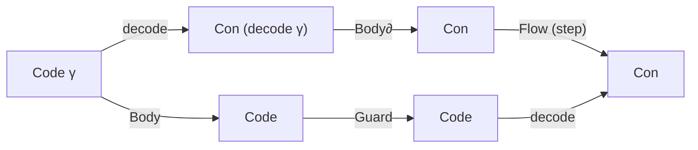

<!--
LogOS: a prototype Agda library for modular dynamic logic systems synthesized by AI
Copyright (C) 2026 AI.IMPACT GmbH
SPDX-License-Identifier: GPL-3.0-only
-->

% View — Controlled Feedback (Budgeted Stabilisation)

```agda
{-# OPTIONS --safe #-}
module docs.Views.ControlledFeedback where

-- Typechecked “view surface” for a control-theoretic reading of LogOS’ guarded
-- Flow / budgeted stabilisation pattern.
--
-- Policy: keep imports on stable API surfaces (`LogOS.API.*`). The prose is
-- interpretation only; the authoritative content is the referenced kernels and
-- theorem bundles.

open import LogOS.Prelude public
open import LogOS.Base.Signature using (LogOSSignature)
open import LogOS.Minimal.Adapter using (QAdapter)
open import LogOS.Minimal.Con using (ConPreorder ; BulkBoundary)
import LogOS.API.Kernel as Kernels

module LK = Kernels
module Shape = Kernels.Shape

-- “Logic transformer” = the minimal closed-loop interface (control vocabulary),
-- packaged as a record so it can be referenced without depending on the full
-- kernel surface at call sites.
--
-- This is not new logical power: `logicTransformerFromKernel` instantiates it
-- from any kernel.

record LogicTransformer
  {ℓ : Level}
  (Code  : Set ℓ)
  (CP    : ConPreorder ℓ)
  (Grade : Set ℓ)
  : Set (lsuc ℓ) where
  open ConPreorder CP using (Con; _⊑_)

  field
    decode : Code → Con
    encode : Con → Code
    decode∘encode : ∀ c → decode (encode c) ≡ c

    step sat : Grade
    Flow : Grade → Con → Con

    Body  : Code → Code
    Body∂ : Con → Con
    body-decode : ∀ γ → decode (Body γ) ≡ Body∂ (decode γ)

    Guard : Code → Code
    guard-decode : ∀ γ → decode (Guard γ) ≡ Flow step (decode γ)

    Th* : Con
    Th*-fixed : (_⊑_ Th* (Flow sat Th*)) × (_⊑_ (Flow sat Th*) Th*)

  -- Derived names (control-style vocabulary).

  Plant∂ : Con → Con
  Plant∂ = Body∂

  Controller : Grade → Con → Con
  Controller = Flow

  ClosedLoop∂ : Con → Con
  ClosedLoop∂ c = Flow step (Body∂ c)

  FlowCode : Code → Code
  FlowCode γ = Guard (Body γ)

  decode-FlowCode
    : ∀ γ → decode (FlowCode γ) ≡ Flow step (Body∂ (decode γ))
  decode-FlowCode γ =
    trans (guard-decode (Body γ))
          (cong (Flow step) (body-decode γ))

  -- “Stabilise at grade g”: encode ∘ Flow g ∘ decode.

  BoxAt : Grade → Code → Code
  BoxAt g γ = encode (Flow g (decode γ))

  decode-BoxAt : ∀ g γ → decode (BoxAt g γ) ≡ Flow g (decode γ)
  decode-BoxAt g γ = decode∘encode (Flow g (decode γ))

  Box : Code → Code
  Box = BoxAt sat

logicTransformerFromKernel
  : ∀ {ℓ : Level} {Sig : LogOSSignature ℓ} {Q : QAdapter ℓ}
    (K : LK.Kernel Sig Q)
  → LogicTransformer
      (LK.Kernel.Code K)
      (BulkBoundary.bnd (LK.Kernel.BB K))
      (LK.GTier.Step (LK.Kernel.G K))
logicTransformerFromKernel K =
  record
    { decode         = LK.Kernel.decode K
    ; encode         = LK.Kernel.encode K
    ; decode∘encode  = LK.Kernel.decode∘encode K
    ; step           = LK.GTier.step (LK.Kernel.G K)
    ; sat            = LK.GTier.sat (LK.Kernel.G K)
    ; Flow           = LK.GTier.Flow (LK.Kernel.G K)
    ; Body           = LK.Kernel.Body K
    ; Body∂          = LK.Kernel.Body∂ K
    ; body-decode    = LK.Kernel.body-decode K
    ; Guard          = LK.Kernel.Guard K
    ; guard-decode   = LK.Kernel.guard-decode K
    ; Th*            = LK.GTier.Th* (LK.Kernel.G K)
    ; Th*-fixed      = LK.GTier.Th*-fixed (LK.Kernel.G K)
    }

module Quotes {ℓ : Level} {Sig : LogOSSignature ℓ} {Q : QAdapter ℓ}
  (K : LK.Kernel Sig Q)
  where

  Code : Set ℓ
  Code = LK.Kernel.Code K

  CP : ConPreorder ℓ
  CP = BulkBoundary.bnd (LK.Kernel.BB K)

  -- “Plant step” (boundary) and “implementation step” (code) relate by decode.
  decode-Body
    : ∀ γ → LK.Kernel.decode K (LK.Kernel.Body K γ)
            ≡ LK.Kernel.Body∂ K (LK.Kernel.decode K γ)
  decode-Body = LK.Kernel.body-decode K

  decode-Guard
    : ∀ γ →
      LK.Kernel.decode K (LK.Kernel.Guard K γ)
        ≡ LK.GTier.Flow (LK.Kernel.G K) (LK.GTier.step (LK.Kernel.G K))
            (LK.Kernel.decode K γ)
  decode-Guard = LK.Kernel.guard-decode K

  decode-FlowCode
    : ∀ γ →
      LK.Kernel.decode K (LK.FlowCode K γ)
        ≡ LK.GTier.Flow (LK.Kernel.G K) (LK.GTier.step (LK.Kernel.G K))
            (LK.Kernel.Body∂ K (LK.Kernel.decode K γ))
  decode-FlowCode = LK.decode-FlowCode K

  -- Operational “compute then stabilise” (the step-grade BoxAt) aligns with FlowCode.
  FlowCode≈BoxAt-step-Body
    : ∀ γ →
      Shape.Code≈ (LK.Kernel.shape K)
        (LK.FlowCode K γ)
        (LK.BoxAt K (LK.GTier.step (LK.Kernel.G K)) (LK.Kernel.Body K γ))
  FlowCode≈BoxAt-step-Body = LK.flowCode≈BoxAt-step-body K

  -- The saturation step has a distinguished lax fixed-point witness `Th*`.
  Th*-fixed
    : (ConPreorder._⊑_ CP
        (LK.GTier.Th* (LK.Kernel.G K))
        (LK.GTier.Flow (LK.Kernel.G K) (LK.GTier.sat (LK.Kernel.G K))
          (LK.GTier.Th* (LK.Kernel.G K))))
      ×
      (ConPreorder._⊑_ CP
        (LK.GTier.Flow (LK.Kernel.G K) (LK.GTier.sat (LK.Kernel.G K))
          (LK.GTier.Th* (LK.Kernel.G K)))
        (LK.GTier.Th* (LK.Kernel.G K)))
  Th*-fixed = LK.GTier.Th*-fixed (LK.Kernel.G K)

  -- Saturation stability: `Box` on code is a closure op (inflation + idempotence),
  -- hence any `Box γ` is stable.

  box-infl
    : ∀ γ → Shape.Code≤ (LK.Kernel.shape K) γ (LK.Box K γ)
  box-infl = LK.box-infl K

  box-idemp-lax
    : ∀ γ → Shape.Code≤ (LK.Kernel.shape K) (LK.Box K (LK.Box K γ)) (LK.Box K γ)
  box-idemp-lax = LK.box-idemp-lax K

  box-stable
    : ∀ γ → LK.BoxStable K (LK.Box K γ)
  box-stable = LK.box-stable K

  -- Budget knob (optional strengthening): the grade order makes `BoxAt` monotone
  -- and (laxly) compositional, with a top/saturation grade.

  module Budget (BT : LK.BudgetedTier K) where
    module D = LK.Derived K BT
    open LK.BudgetedTier BT

    boxAt-mono-grade
      : ∀ {g g'}
      → _≤g_ g g'
      → (γ : Code)
      → Shape.Code≤ (LK.Kernel.shape K) (LK.BoxAt K g γ) (LK.BoxAt K g' γ)
    boxAt-mono-grade = D.boxAt-mono-grade

    boxAt-comp-lax
      : ∀ g g' (γ : Code)
      → Shape.Code≤ (LK.Kernel.shape K)
          (LK.BoxAt K g' (LK.BoxAt K g γ))
          (LK.BoxAt K (_·g_ g g') γ)
    boxAt-comp-lax = D.boxAt-comp-lax

    boxAt≤Box
      : ∀ g (γ : Code)
      → Shape.Code≤ (LK.Kernel.shape K) (LK.BoxAt K g γ) (LK.Box K γ)
    boxAt≤Box = D.boxAt≤Box

    -- Worked example: monotone truth predicates can be “budget-upgraded”.
    --
    -- Control reading: if a claim is true of the stabilised output at budget g,
    -- then it is true of any higher-budget stabilised output.

    budget-upgrade
      : ∀ {ℓT : Level}
        (TruthK : Code → Set ℓT)
      → (monoTruth : ∀ {γ δ}
          → Shape.Code≤ (LK.Kernel.shape K) γ δ
          → TruthK γ
          → TruthK δ)
      → ∀ {g g'}
      → _≤g_ g g'
      → ∀ γ → TruthK (LK.BoxAt K g γ) → TruthK (LK.BoxAt K g' γ)
    budget-upgrade TruthK monoTruth g≤g' γ t =
      monoTruth (boxAt-mono-grade g≤g' γ) t

    budget-to-sat
      : ∀ {ℓT : Level}
        (TruthK : Code → Set ℓT)
      → (monoTruth : ∀ {γ δ}
          → Shape.Code≤ (LK.Kernel.shape K) γ δ
          → TruthK γ
          → TruthK δ)
      → ∀ g γ → TruthK (LK.BoxAt K g γ) → TruthK (LK.Box K γ)
    budget-to-sat TruthK monoTruth g γ t =
      monoTruth (boxAt≤Box g γ) t

  -- Base “communicable truth” pattern: report after saturation.
  --
  -- This is intentionally not the maximal construction (`Comm⋆` / `Pr`); it is
  -- the simplest stable wrapper you can always build from the closure laws of `Box`.

  PrBase
    : ∀ {ℓT : Level}
      (TruthK : Code → Set ℓT)
    → Code → Set ℓT
  PrBase TruthK γ = TruthK (LK.Box K γ)

  PrBase-stable
    : ∀ {ℓT : Level}
      (TruthK : Code → Set ℓT)
    → (monoTruth : ∀ {γ δ}
        → Shape.Code≤ (LK.Kernel.shape K) γ δ
        → TruthK γ
        → TruthK δ)
    → ∀ γ →
        (PrBase TruthK γ → PrBase TruthK (LK.Box K γ))
        ×
        (PrBase TruthK (LK.Box K γ) → PrBase TruthK γ)
  PrBase-stable TruthK monoTruth γ =
    ( to , from )
    where
      to : PrBase TruthK γ → PrBase TruthK (LK.Box K γ)
      to t =
        monoTruth (box-infl (LK.Box K γ)) t

      from : PrBase TruthK (LK.Box K γ) → PrBase TruthK γ
      from t =
        monoTruth (box-idemp-lax γ) t
```

Purpose
-------
This view is a control-theoretic reading of the LogOS **controlled feedback**
pattern: instead of treating recursion/feedback as a silent global μ-upgrade,
LogOS makes “compute, then stabilise what can be communicated” a first-class,
typed interface.

The intended payoff is vocabulary: many design decisions in the kernel look
like standard control moves once you read:

- boundary constraints as the “state of knowledge at an interface”, and
- `Flow` as an explicit stabilising/communication discipline.

Interpretation (analogy):
this is a dictionary, not a claim that the kernel *is* a physical control
system. The literal content is the imported/typechecked Agda surfaces.

Terminology (literature ↔ LogOS): `docs/Terminology.lagda.md`.
Claim/assumption discipline: `docs/Kernel/ClaimRegister.lagda.md`.

Notation (local)
----------------
- `c ⊑ d`: refinement/order (information increase).
- `c ≈ d`: mutual refinement.
- `P ↔ Q`: satisfaction equivalence.
- `x ≡ y`: propositional equality (`_≡_`).
- “budget/grade” means a `QAdapter` scale element (optionally structured by a `BudgetedTier`).

Scope (formal)
--------------
- Parameter: `Kernel Sig Q`.
- Canonical typed anchors in this note come from kernel fields/laws and the
  `LogOS/API/Kernel.agda` derived budgeted interface.
- Transformer-alignment claims are scoped to the explicit experimental bridge
  modules cited below; no architecture-level identification is assumed globally.

Assumptions (explicit)
----------------------
- This note is interpretive: control/transistor language is orientation only.
- Budget monotonicity/composition claims require an explicit `BudgetedTier K`.
- Any “transformer alignment” claim is about the typed controlled-feedback
  interface (closure/budget transport), not a blanket equality with attention
  architecture semantics.

Dictionary (literature ↔ LogOS)
-------------------------------

| Control-theory term | LogOS identifier(s) | Reading |
|---|---|---|
| State | boundary constraint `c : Con` | “what the boundary currently claims / exposes” |
| Plant (open-loop update) | `Body∂ : Con → Con` | computation/update before communication discipline |
| Controller / feedback element | `Flow : Step → Con → Con` | stabilising closure applied after the plant step |
| Closed-loop step | `Flow step (Body∂ c)` | one “compute then stabilise” tick |
| Actuation at code level | `Guard : Code → Code` | internalises `Flow step` under `decode` |
| Implementation step | `FlowCode = Guard ∘ Body` | code-level closed-loop step |
| Budget / horizon / effort | grade `g` + `BoxAt g` | “how much stabilisation/observation is permitted” |
| Saturation (full closure) | `sat` + `Box` | “maximal stabilisation available in this kernel” |
| Steady-state / invariant | `Th*` (+ `Th*-fixed`) | a distinguished lax fixed-point witness at saturation |
| Largest reportable invariant fragment | `Comm⋆` / `Pr` | maximal Flow-compatible communicable truth notion |

Core definitions (literature style)
-----------------------------------

**Definition (Closed-loop tick).** The controlled-feedback step is
\[
  c \mapsto \mathrm{Flow}_{step}(\mathrm{Body∂}(c)).
\]
At code level this is realized by `FlowCode = Guard ∘ Body`, with decode
commutation as the correctness witness.

**Definition (Budgeted stabiliser family).** A graded family `BoxAt g` is the
stabiliser indexed by a budget/grade:
`BoxAt g γ = encode (Flow g (decode γ))`. With `BudgetedTier`, these maps are
monotone in budget and laxly compositional.

**Definition (Logic transformer).** A logic transformer is this controlled loop
packaged as an explicit interface (decode/encode, plant, stabiliser, fixed-point
witness), so transport and composition are theorem-level rather than narrative.

What is novel here (residual vs the literature)
-----------------------------------------------
- Matches literature: explicit plant/controller/closed-loop decomposition and
  budget-as-control-parameter vocabulary.
- Weaker/lax by default: invariants are order-theoretic (`⊑`, `≈`) rather than
  numeric/metric or equality-level dynamical guarantees.
- Added by LogOS: decode/encode coherence and boundary-first transport make
  “closed-loop correctness” a typed interface.
- Assumption-scoped: stronger budget laws and transformer-alignment routes are
  explicit optional layers (`BudgetedTier`, experimental bridge modules).

Theorem spine (authoritative)
-----------------------------
- Core closed-loop coherence:
  `LogOS/Kernel.agda` (`body-decode`, `guard-decode`, `decode-FlowCode`,
  `flowCode≈BoxAt-step-body`).
- Budgeted graded laws:
  `LogOS/Kernel/BudgetedTier.agda` and `LogOS/API/Kernel.agda` (`Derived`).
- Communicable truth (maximal and budgeted variants):
  `LogOS/Theorems/Meta/CommunicableTruth.agda`,
  `LogOS/Theorems/Meta/BudgetedCommunicableTruth.agda`.
- Experimental transformer/controlled-feedback alignment anchors:
  `LogOS/Packs/Agents/Experimental/Arguments/TransformerFormalization.agda`,
  `LogOS/Packs/Agents/Experimental/Arguments/TransformerBridge.agda`,
  `LogOS/Packs/Agents/Experimental/Arguments/DocsAnchors.agda`.
- The prose below is explanatory; these surfaces are the authoritative claims.

Futamura vs Diagonal (anchored split)
-------------------------------------
Use the same two claim IDs here, but with control vocabulary:

- `claim.futamura.transport`:
  compile/rebase translations of control-facing representations are
  compositional and unique up to boundary semantics.
  Anchors:
  `LogOS/Theorems/Meta/SemanticsTransport.agda`,
  `LogOS/Ports/Semantic/Interoperability.agda`,
  and the in-place exposure in
  `LogOS/Theorems/Meta/CHL/ModelTheory.agda`
  (`RepresentationIndependence`).
- `claim.diagonal.limit`:
  no controller/observer interface can self-certify total separation globally;
  at any fixed budget there are unavoidable no-witness inputs.
  Anchors:
  `LogOS/Theorems/Meta/SpectralSeparationOutput.agda`,
  `LogOS/Theorems/Meta/BudgetedSeparationOutput.agda`,
  and the in-place exposure in
  `LogOS/Theorems/Meta/CHL/ModelTheory.agda`
  (`SeparationBoundary`).

Control interpretation:
the transport side gives constructive interoperability of feedback designs; the
diagonal side gives the hard limit on universal self-certification.

Core pattern: compute-then-stabilise as a closed loop
-----------------------------------------------------
At the boundary level, the operational tick is:

```text
c  ↦  Body∂ c  ↦  Flow step (Body∂ c)
```

At the code level, the kernel provides an implementation tick:

```text
γ  ↦  Body γ  ↦  Guard (Body γ) = FlowCode γ
```

and the key coherence is a commuting diagram (decode commutes with evolution):



Formally (anchors):
- `decode (Body γ) ≡ Body∂ (decode γ)` (`LogOS/Kernel.agda`, field `body-decode`)
- `decode (Guard γ) ≡ Flow step (decode γ)` (`LogOS/Kernel.agda`, field `guard-decode`)
- hence `decode (FlowCode γ) ≡ Flow step (Body∂ (decode γ))` (derived lemma `decode-FlowCode`)

This is the basic “control diagram” you can re-use when explaining:
- why feedback is explicit (there is a named stabiliser), and
- why the implementation is faithful (one-step commutation is part of the kernel interface).

Budgeted feedback: the grade as a control knob
----------------------------------------------
The guarded tier exposes *graded* stabilisation:

- `BoxAt g γ` is “apply the stabiliser at grade `g` to code `γ`”.
- `Box γ` is “apply the stabiliser at saturation”.

If you assume a `BudgetedTier K` (optional strengthening), the grade structure
acts like a control-theory “effort/horizon algebra”:

- monotone in grade (more budget ⇒ at least as much stabilisation),
- laxly compositional in time/effort (`BoxAt g' (BoxAt g γ) ≤ BoxAt (g ·g g') γ`),
- bounded above by saturation (`BoxAt g γ ≤ Box γ`).

Anchors (budgeted tier derived laws): `LogOS/Kernel/BudgetedTier.agda` and
`LogOS/API/Kernel.agda` (module `Derived`).

Interpretation (analogy):
think of `g` as a knob that limits measurement/communication bandwidth or the
permitted amount of “filtering” applied after each computational tick.

“Logic transistor”: why the pattern feels like a transistor
-----------------------------------------------------------
The transistor intuition comes from the **three-interface** nature of the
pattern:

1) a high-powered internal evolution (`Body` / `Body∂`),
2) a stabilising boundary discipline (`Flow`, implemented by `Guard`), and
3) an explicit control parameter (the grade/budget `g` driving `BoxAt g`).

Interpretation (analogy):
map these to the three terminals:

- **collector/drain**: the “raw computation power” (`Body` / `Body∂`),
- **base/gate**: the control input (budget/grade `g`),
- **emitter/source**: the stabilised, communicable output (`Flow`/`BoxAt` result).

What is *different* from an electrical transistor is also the point of the library:

- There is no numeric gain/linearity; the “signal order” is refinement (`⊑`), and stability is an order-theoretic closure property.
- Saturation is not a voltage rail; it is a distinguished closure grade `sat` with inflation/idempotence laws.
- “Correctness of the wiring” is not a physical circuit law; it is a typed commutation law (`decode` commutes with one-step evolution).

Proposed term: **logic transformer** (working vocabulary)
---------------------------------------------------------
To talk about this pattern without committing to the transistor metaphor, it is
useful to name the abstraction:

> A **logic transformer** is a kernel’s controlled-feedback interface viewed as a component:
> it takes an internal step (`Body`), then enforces an explicit stabilisation regime (`Flow`/`BoxAt`),
> with the regime indexed by a budget/grade.

Transformer (GenAI) name collision
----------------------------------
The term “transformer” is overloaded. In the GenAI literature it usually means
the sequence-to-sequence attention architecture.

This repository includes an explicit (experimental) formalization of that notion:

- `LogOS/Packs/Agents/Experimental/Arguments/TransformerFormalization.agda`
  (`TransformerCore`: tokens/parameters/forward + kernel-native encoding).
- `LogOS/Packs/Agents/Experimental/Arguments/TransformerBridge.agda`
  (multi-head attention skeleton + bridge to kernel policies/codes).
- Narrative entrypoint: `docs/Applications/Agents_Experimental.lagda.md`.

The `LogicTransformer` record in this view is a different object: it is a
kernel-side controlled-feedback interface (decode/encode + plant step `Body`/`Body∂`
+ explicit stabiliser `Flow`/`BoxAt`).

Formal overlap (typechecked):
in the Agents experimental pack, “training steps” are RG steps
`RGStep g = ClosureStepAt K g`, i.e. boundary endomaps that are:

- inflationary (a “feedback” update does not lose information), and
- bounded by the kernel’s graded stabiliser/flow at budget `g`
  (the step ships with `leFlow : applyRG s c ⊑ Flow g c`).

This is the precise, checkable sense in which transformer training is a
controlled-feedback story in LogOS. See
`LogOS/Packs/Agents/Experimental/Arguments/DocsAnchors.agda` (module `ControlledFeedbackAlignment`).

Is this alignment natural?
--------------------------
Yes for **training dynamics**, and not-by-default for the **attention forward pass**.

- Training (natural): the library chooses the *controlled feedback* interface
  as the primitive notion of “training step” (`RGStep g` is a budgeted closure
  step, carrying `infl` + `leFlow`).

- Forward architecture (not-by-default): a transformer block (multi-head
  attention + residual/norm + FFN) is a computation endomap on some
  representation space; it is not canonically a closure/stabiliser on boundary
  constraints. To identify it with `Flow` you would need:
  1) an explicit information preorder on representations, and
  2) proofs of the closure laws (monotonicity, inflation, idempotence up to `⊑`)
     in that preorder (and then a bridge into the boundary `Con` story).

Natural wiring (recommended):
read the transformer forward pass as part of the plant step (`Body`), and read
`Flow`/`BoxAt` as an explicit *stabilisation / reporting / communication*
discipline applied afterwards. This keeps the “compute then stabilise” move
literal without forcing attention to satisfy closure axioms.

Interpretation (analogy):
this does not identify the attention *architecture* with the kernel’s `Flow`;
it identifies the training/stability interface as a graded closure discipline.

Residual-boundary discovery (partial representation independence)
----------------------------------------------------------------
The transformer scaling pipeline now makes discovery explicit as a boundary
residual predicate: pick `ρ : Dec → Resid`, then define discovery on
`ρ (decode γ)` rather than on raw representations.

Control reading: architecture details can vary as long as the residual boundary
class is unchanged. This is the LogOS-style “residual boundary is enough”
principle (representation-independence, but only at the chosen boundary cut).

Packaged (typechecked)
----------------------
This view includes a small record `LogicTransformer` that packages exactly the
control-facing interface (decode/encode, plant step, controller `Flow`, the
closed-loop tick, and the steady-state witness `Th*`), plus the coherence laws.

The constructor `logicTransformerFromKernel` shows this is not new content: any
`Kernel` already contains a logic transformer; the record is just a vocabulary
bundle.

Concretely, for a kernel `K` the data are already there (no new axioms):

- code space `Code`, boundary space `Con`,
- a measurement/realisation map `decode : Code → Con`,
- a plant step `Body∂ : Con → Con` and its code realisation `Body : Code → Code`,
- a stabiliser `Flow g : Con → Con` and its code realisation `BoxAt g : Code → Code`,
- commutation/coherence laws making the square commute (so the “component” is faithful).

This term is meant to emphasise *composition*: a logic transformer is the thing
you can wire into a ports/adapters architecture while keeping the stabilisation
discipline explicit and budget-indexed.

Worked micro-example: tuning the budget knob
--------------------------------------------
Assume a `BudgetedTier K` so grades form an ordered monoid and `BoxAt` is
monotone in the grade. Then for any code `γ` and any grades `g ≤g g'` you get a
checked refinement chain:

```text
BoxAt g γ  ≤  BoxAt g' γ  ≤  Box γ
```

Control reading: increasing the “effort / horizon / bandwidth” budget can only
increase the stabilised output (and it is always bounded by saturation).

If you also have a *monotone* truth predicate `TruthK` on code, you can upgrade
claims across budgets:

```text
TruthK (BoxAt g γ)  →  TruthK (BoxAt g' γ)  →  TruthK (Box γ)
```

These are anchored in the typechecked `Quotes.Budget` surface (`boxAt-mono-grade`,
`boxAt≤Box`, plus the tiny derived helper `budget-upgrade` / `budget-to-sat`).

Base “communicable truth”: report after saturation
-------------------------------------------------
The maximal communicable fragment `Pr`/`Comm⋆` is defined in
`LogOS/Theorems/Meta/CommunicableTruth.agda` (and the grade-indexed variants in
`LogOS/Theorems/Meta/BudgetedCommunicableTruth.agda`). This view also includes a
minimal, always-available base version:

- define `PrBase TruthK γ = TruthK (Box γ)` (“only report after full stabilisation”).

Assuming `TruthK` is monotone, `PrBase TruthK` is stable under further
stabilisation (`PrBase-stable`): applying `Box` again does not change what you
report. Control reading: you have forced a closed-loop invariant by reporting
only from the steady state.

Micro-example (control-style): “apply f, then close under Flow”
---------------------------------------------------------------
The kernel provides a small endomap DSL where `Flow` at saturation behaves like
a closure operator. In particular, you can “close” any boundary endomap `f` by:

```text
Flow-closeEndo f  =  Flow ∘ f
```

(up to the library’s `≤`-based closure packaging). This yields a `ClosureStep`
that is *sandwiched*:

```text
id ≤ Flow-closeEndo f ≤ Flow
```

Control-theoretic reading:
`Flow-closeEndo` is the universal “put the stabiliser in the loop” operation.
It is exactly the move “add a feedback filter after the plant”.

Anchors: `LogOS/Kernel/Endo.agda` (ungraded analogue: `LogOS/Kernel/UngradedKernel/Endo.agda`).

Pointers (where this view connects in the docs)
-----------------------------------------------
- Controlled feedback / communication boundary: `docs/DeepDive/Communication.lagda.md`
- Budgeted self-reference (diagonal) storyline: `docs/DeepDive/FutamuraDiagonal_Showcase.lagda.md` (Part E)
- Observer-semantics / resource reading of stability: `docs/Views/ObserverSemantics.lagda.md`
- Formal semantics contract (residual-boundary rule): `docs/Views/FormalSemantics.lagda.md`
- Kernel endomap/closure tooling: `LogOS/Kernel/Endo.agda`
- Maximal Flow-stable (“communicable”) truth and projection `Pr`: `LogOS/Theorems/Meta/CommunicableTruth.agda`
- Box/BoxAt-based budgeted communicability: `LogOS/Theorems/Meta/BudgetedCommunicableTruth.agda`

Cross references
----------------
- Views index: `docs/Views/All.lagda.md`
- Formal semantics contract: `docs/Views/FormalSemantics.lagda.md`
- Universal logic (presentation transport): `docs/Views/UniversalLogic.lagda.md`
- Meredith sentences (compact kernel anchors): `docs/Views/MeredithSentences.lagda.md`
